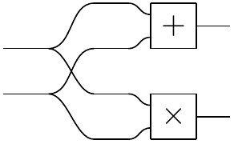
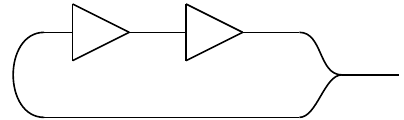

# HyperAST

A (currently experimental) frontend to
[open-hypergraphs](https://github.com/statusfailed/open-hypergraphs/)
which lets you define open hypergraphs in a pointful
(i.e., not [point-free](https://en.wikipedia.org/wiki/Tacit_programming) ) style.
Here's a 1-bit adder circuit:

    @hypergraph
    def adder(x0, x1):
        y0 = x0 + x1 # sum
        y1 = x0 * x1 # carry
        return [y0, y1]

This builds an open hypergraph representing a string diagram like this:

Unlike python code, hypergraphs are fully combinatorial: there is no implicit
assumption of 'causal' control flow.
For example, we can define a hypergraphs with *feedback*, such as a
[ring oscillator](https://en.wikipedia.org/wiki/Ring_oscillator):

    @hypergraph
    def ring_oscillator():
        x0 = node()
        x1 = ~x0 # we use x0 before declaring it - this is OK!
        unify(x0, ~x1) # connect x0 and x1
        return [x0]

This defines a string diagram like the one below:

# Alternative interface

There is also a WIP alternative interface which inspects python syntax to define
a hypergraph.
Variables serve as hypernodes while functions and python operators are (labeled)
hyperedges.
 The first example looks the same:

    @hypergraph
    def adder(x0, x1):
        y0 = x0 + x1 # sum
        y1 = x0 * x1 # carry
        return [y0, y1]

... but there is less overhead when writing hypergraphs with more unusual
structure:

    @hypergraph
    def ring_oscillator():
        x1 = ~x0 # we use x0 before declaring it - this is OK
        x0 = ~x1
        return [x0]

Unlike the normal interface, this style does not execute the python code; it
only inspects it.
